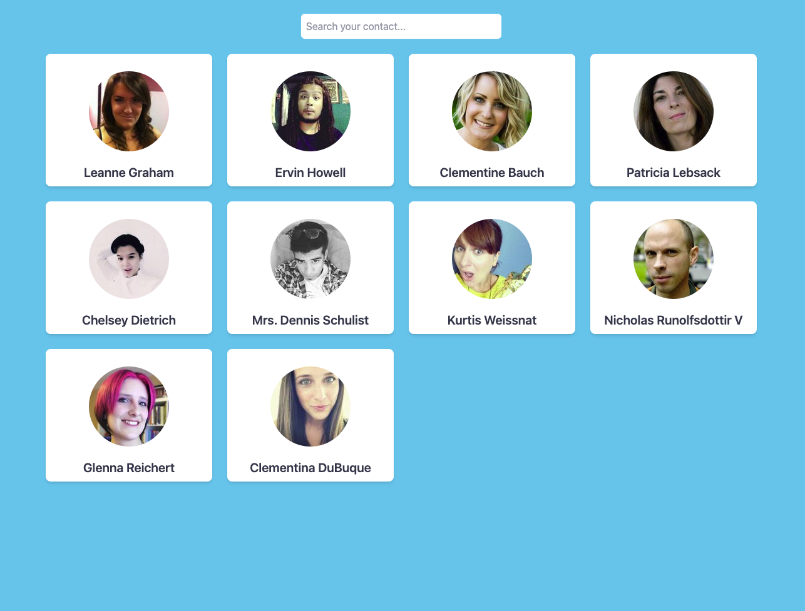

# Responsive Contact Directory

You can check out the link for this project: https://pipe-mv.github.io/responsive-contact-directory/

### What is this?

This is a repository with a contact directory that allows you to search for your contact, if you write just one letter it will show you all the contacts that start with that letter but if you write more than one letter it will show you all contacts that contains those caracters in their names and once found, you can click on the contact and it will display all its information in a beautiful modal window

Also, this applicatin uses React and some of its components as React Hooks, Data fetching y Github Pages for its deployment.

For the style I used Tailwind CSS as framework and React Icons for the icons on the cart of the contact




## Clone the repository

Clone this repository by copying this link in the terminal

```bash
https://github.com/pipe-mv/responsive-contact-directory.git
```

### Installing dependencies

After cloned, navigate inside the project. Change "project_folder" to the folder just created by the `clone` command

```bash
  cd project_folder/
```

You'll need to install the project's dependencies by runing this comand in the terminal:

```bash
  npm install
```

### Running the application

Finally, run to start using the apllication by typing the comand:

```bash
  npm start
```

